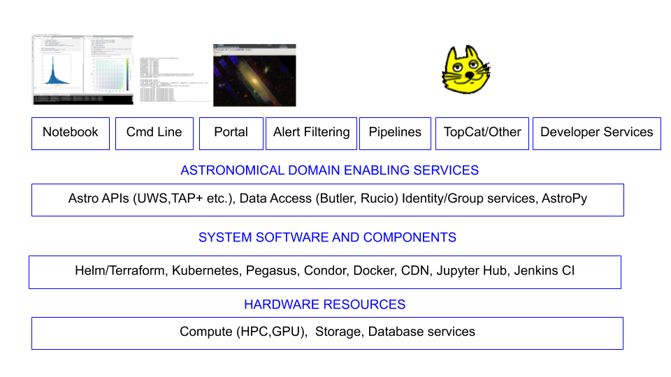

..
  See https://developer.lsst.io/restructuredtext/style.html
  for a guide to reStructuredText writing.

:tocdepth: 2

.. sectnum::

.. note::

   **This technote is not yet published.**

   2019 saw significant changes have taken place in IT. Here we address the team structure and responsibilities. We put forward some planning and start on an estimate to complete for IT.

.. Add content here.
.. Do not include the document title (it's automatically added from metadata.yaml).

Introduction
============

In this document we layout the IT approach to the Rubin Observatory  construction. It will refer to other specific tech notes for details. 

We wish to build a modern approach to IT just close enough to the cutting edge to allow us remain current at the start of operations but preferably not quite the bleeding edge. 
To best support deployment we must have an element of research and development in the IT team.

The general Cyber Infrastructure approach of LSST is layered as in the diagram :ref:`Cyber Infrastructure <fig-ci-lsst>` from :cite:`2019arXiv190713060O`

Vera Rubin Observatory Cyber Infrastructure stack.

.. Original https://drive.google.com/open?id=16w5WVe-_xNLXWudNKqJu9IEKGDQ8oIB0eDiqWP_SUnE

Organization
============
IT north and south share a single Jira system where tickets can be tracked. 

The IHS project contains the first line help desk tickets which may be assigned to IT north, south or the Data Facility.See also https://confluence.lsstcorp.org/display/~dtapia/How+to+file+a+JIRA+Ticket+for+IT+User+Support.
The ITIL based Helpdesk is described in Detail on https://confluence.lsstcorp.org/display/IT/LSST+ITSI+-+IT+Service+Desk [#]_

There is also an IT Support project which relates more to Rubin development oriented IT planning. The priorities for IT planning are set with the Telescope ad Site project manger and may be viewed on 
https://confluence.lsstcorp.org/display/IT/IT+Chile+Priorities

The IT managers north and south Tag up on Monday with the deputy project manager for software to
discuss issues concerning IT in general. 

The IT manager south, DF Manager, T&S Software Manager and DM SQuaRE manager tag up with the deputy project manager for software to discuss cross cutting issues and priorities. 

The physical locations are discussed in :ref:`physicallocs`

.. [#] This should not be in confluence but rather a tech note. 

.. include:: physical.rst
 
.. include:: telescope.rst

.. include:: areas.rst

.. include:: documentation.rst

Interactions/Interface
======================
- T&S
- DM
- OIR LAB

.. include:: openissues.rst

.. include:: acronyms.rst 

.. rubric:: References

.. bibliography:: local.bib lsstbib/books.bib lsstbib/lsst.bib lsstbib/lsst-dm.bib lsstbib/refs.bib lsstbib/refs_ads.bib
   :style: lsst_aa
