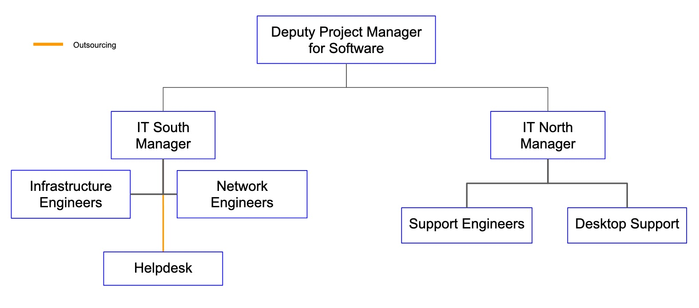

..
  See https://developer.lsst.io/restructuredtext/style.html
  for a guide to reStructuredText writing.

:tocdepth: 2

.. sectnum::

.. note::

   **This technote is not yet published.**

   2019 saw significant changes have taken place in IT. Here we address the team structure and responsibilities. We put forward some planning and start on an estimate to complete for IT.

.. Add content here.
.. Do not include the document title (it's automatically added from metadata.yaml).

Introduction
============

In this document we layout the IT approach to the Rubin Observatory  construction. It will refer to other specific tech notes for details.

We wish to build a modern approach to IT just close enough to the cutting edge to allow us remain current at the start of operations but preferably not quite the bleeding edge.
To best support deployment we must have an element of research and development in the IT team.

The general Cyber Infrastructure approach of Rubin Observatory is layered as in the diagram :ref:`Cyber Infrastructure <fig-ci-lsst>` from :cite:`2019arXiv190713060O`

.. figure:: images/CI-LSST.png
   :name: fig-ci-lsst
   :alt: Vera Rubin Observatory Cyber Infrastructure stack.

Vera Rubin Observatory Cyber Infrastructure stack.

.. Original https://drive.google.com/open?id=16w5WVe-_xNLXWudNKqJu9IEKGDQ8oIB0eDiqWP_SUnE

Organization
============

The IT group in Rubin Observatory has the following organization:

IT north and south share a single Jira system where tickets can be tracked.

There is also an IT Support project which relates more to Rubin development oriented IT planning. The priorities for IT planning are set with the Telescope ad Site project manger and may be viewed on
https://confluence.lsstcorp.org/display/IT/IT+Chile+Priorities

The IT managers north and south tag up on Monday with the deputy project manager for software to
discuss issues concerning IT in general.

The IT manager south, DF Manager, T&S Software Manager and DM SQuaRE manager tag up with the deputy project manager for software to discuss cross cutting issues and priorities.

IT North and South and interactions
-----------------------------------
IT North and South meet every week on Monday to discuss current and future work of the network.

IT South
--------
The IT South group is divided in 3 main areas: Infrastructure, Networking and Helpdesk.

Infrastructure and Networking provide support and development to the production environment of Rubin Observatory.

Helpdesk support is provided by a contractor, covering both sites (base and summit).

To organize work, there are several scheduled meetings covering all the aspects of the IT operations in the South.

- Daily group standup: Everyday at the beginning of the day, each team member reports in Slack the planned work for the day.
- Weekly Devops standup: Videoconference/In person meeting happening 3 days per week to discuss infrastructure related work.
- Weekly Network standup: Videoconference/In person meeting happening 3 days per week to discuss network related work.
- Weekly IT group meeting: Videoconference/In person meeting to discuss all work of the week and upcoming work.
- Monthly tickets clean: Videoconference/In person meeting to review and close Jira tickets.

IT North
--------
-

.. include:: physical.rst

.. include:: areas.rst

.. include:: sre.srt

.. include:: documentation.rst

.. include:: interactions.rst

.. include:: openissues.rst

.. include:: acronyms.rst

.. rubric:: References

.. bibliography:: local.bib lsstbib/books.bib lsstbib/lsst.bib lsstbib/lsst-dm.bib lsstbib/refs.bib lsstbib/refs_ads.bib
   :style: lsst_aa
